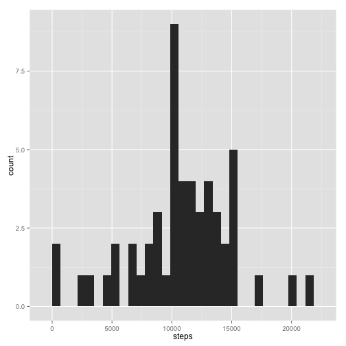
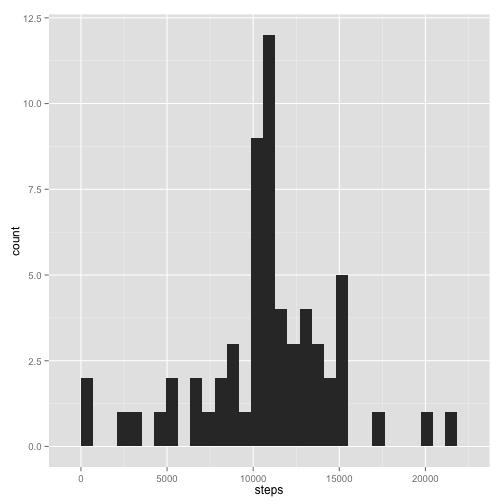
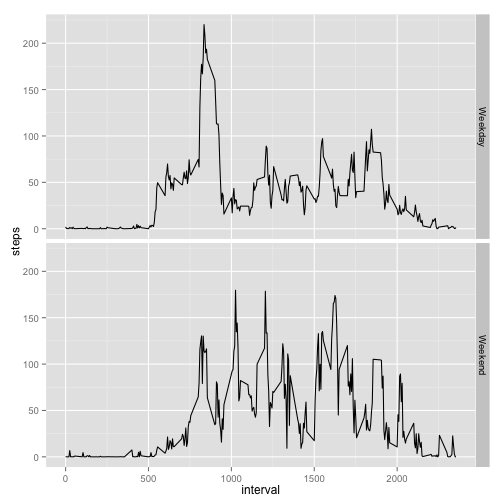

## Loading and preprocessing the data

```r
activity <- read.csv("activity.csv")
activity.by.day <- aggregate(. ~ date, data = activity, sum)[, 1:2]
activity.by.time <- aggregate(. ~ interval, data = activity, mean)[, 1:2]
```


## What is mean total number of steps taken per day?
Make a histogram of the total number of steps taken each day  


```r
library(ggplot2)
qplot(steps, data = activity.by.day, geom = "histogram")
```

```
## stat_bin: binwidth defaulted to range/30. Use 'binwidth = x' to adjust this.
```

 


Calculate and report the mean and median total number of steps taken per day  


```r
mean.step <- mean(activity.by.day$steps)
median.step <- median(activity.by.day$steps)
```

Mean number of steps taken each day is 1.0766189 &times; 10<sup>4</sup>.  
Median number of steps taken each day 10765.  

## What is the average daily activity pattern?
Make a time series plot (i.e. type = "l") of the 5-minute interval (x-axis) and the average number of steps taken, averaged across all days (y-axis)  


```r
ggplot(activity.by.time, aes(x = interval, y = steps)) +
    geom_line()
```

 

Which 5-minute interval, on average across all the days in the dataset, contains the maximum number of steps?

```r
activity.by.time$interval[which.max(activity.by.time$steps)]
```

```
## [1] 835
```


## Imputing missing values
Calculate and report the total number of missing values in the dataset (i.e. the total number of rows with NAs)  


```r
num.na <- sum(is.na(activity$steps) | is.na(activity$date) | is.na(activity$interval))
```

The total number of rows with NAs is 2304.

Devise a strategy for filling in all of the missing values in the dataset. The strategy does not need to be sophisticated. For example, you could use the mean/median for that day, or the mean for that 5-minute interval, etc.


Here the the missing values are filled with the mean for that 5-minute interval.

```r
activity.filled <- activity
for(i in 1:nrow(activity.filled)){
    if(is.na(activity.filled$steps[i])){
        interval.id <- which(activity.by.time$interval == activity.filled$interval[i])
        activity.filled$steps[i] <- activity.by.time$steps[interval.id]
    }
}
head(activity.filled)
```

```
##       steps       date interval
## 1 1.7169811 2012-10-01        0
## 2 0.3396226 2012-10-01        5
## 3 0.1320755 2012-10-01       10
## 4 0.1509434 2012-10-01       15
## 5 0.0754717 2012-10-01       20
## 6 2.0943396 2012-10-01       25
```

Histogram of the total number of steps taken each day after missing values are imputed

```r
activity.by.day.filled <- aggregate(. ~ date, data = activity.filled, sum)[, 1:2]
qplot(steps, data = activity.by.day.filled, geom = "histogram")
```

```
## stat_bin: binwidth defaulted to range/30. Use 'binwidth = x' to adjust this.
```

 


## Are there differences in activity patterns between weekdays and weekends?

```r
library(dplyr)
activity.filled <- mutate(activity.filled, date = as.Date(date), is.weekend = NA)
for(i in 1:nrow(activity.filled)){
    if(weekdays(activity.filled$date[i]) %in% c("Saterday", "Sunday")){
        activity.filled$is.weekend[i] <- "Weekend"
    }else{
        activity.filled$is.weekend[i] <- "Weekday"
    }
}

activity.mean.wday <- aggregate(. ~ interval + is.weekend, 
                                data = activity.filled, mean)
ggplot(activity.mean.wday, aes(x = interval, y = steps)) +
    geom_line() +
    facet_grid(is.weekend ~ .)
```

 

